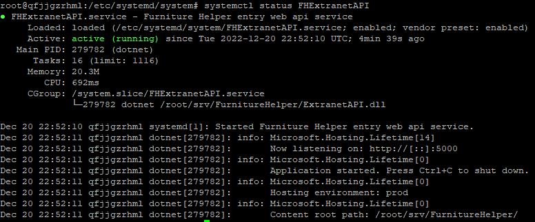

## Описание prod среды
Виртуальный сервер «Dominating Natalia»

IP-адрес:   62.217.183.33
Имя пользователя:   root
ОС:   Ubuntu 22.04
Способ авторизации:   Password

## Установка .Net 6 sdk
*информация на 20.12.22 - сейчас на ubuntu нет .net 7, поэтому качаем 6*

Note: данный блок необходимо выполнять только если вы настраиваете новую машину, если следующие команды уже были выполнены, то можно перейти дальше

**Выполняем:**
sudo apt-get update &&
sudo apt-get install -y dotnet-sdk-6.0

Здесь сразу идет cli, runtime

**Проверяем, что все прошло успешно:**
dotnet --info

в консоли должна появится информация о .net, там должно содержаться:
Host:
  Version:      6.0.11
  Architecture: x64
  Commit:       943474ca16

## Запуск приложения

### Clone
cd src
git clone https://github.com/AndreyIo0I/furniture-helper

### Run
*данная команда нужна только для проверки работы приложения, для реального запуска будем использовать publish*

cd /root/src/furniture-helper/back/FurnitureHelper/src/ExtranetAPI
dotnet run -c Release

### Publish
*компилируем приложение в папку, из которой оно будет развернуто*
dotnet publish -c Release --runtime ubuntu.22.04-x64 -o /root/srv/FurnitureHelper --self-contained false /p:EnvironmentName=prod

### open port
ufw allow 3000
ufw enable
ufw reload

### Запуск
cd /root/src/furniture-helper/back/FurnitureHelper/hosting/linux_raw

cp FHExtranetAPI.service /etc/systemd/system/FHExtranetAPI.service

systemctl daemon-reload

systemctl start FHExtranetAPI

systemctl status FHExtranetAPI:

health check:
http://62.217.183.33:5000/health

Если что-то не так, то логи зауска:
journalctl -u FHExtranetAPI.service -b -n 100 --no-pager

### Выполнение миграций:
После publish:

cd /root/srv/FurnitureHelper

dotnet /root/srv/FurnitureHelper/Infastructure.Migrations.dll тут нет r в слове 'Infrastructure', так и должно быть

Вопросы?
